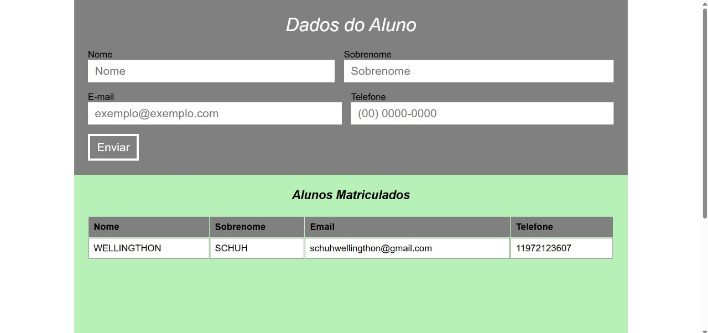

# 🎓 StudentEnrollment

## 📌 Descrição
Projeto em **JavaScript** que simula um sistema simples de matrícula de alunos.  
O usuário pode preencher os campos de **Nome, Sobrenome, Email e Telefone** e, ao clicar em **Enviar**, os dados são adicionados a uma tabela exibida na área **Alunos matriculados**.

> Os campos não são obrigatórios — é possível enviar informações em branco e mesmo assim o aluno será listado.

---

## ⚙️ Funcionalidades
- Formulário com campos: Nome, Sobrenome, Email e Telefone.
- Botão **Enviar** que adiciona os dados à tabela.
- Exibição dinâmica dos alunos matriculados.
- Permite inserção mesmo com campos em branco.

---

## 🛠️ Tecnologias utilizadas
- HTML5
- CSS3
- JavaScript (JS)

---

## 📸 Preview


---

## 🚀 Como visualizar

Você pode abrir o projeto localmente:

1. Baixe ou clone este repositório:
   - Clique em **Code > Download ZIP** e extraia os arquivos  
   - ou use o comando:
     ```bash
     git clone https://github.com/WellingthonSchuh/StudentEnrollment.git
     ```

2. Abra o arquivo `index.html` em qualquer navegador moderno.

Ou

1. Acesse o site:
   - https://wellingthonschuh.github.io/StudentEnrollment/

> ⚠️ O projeto é totalmente seguro. Nenhum dado é armazenado em servidor — tudo é exibido apenas localmente no navegador.

---

## 📚 Aprendizados
- Criação e manipulação de formulários com JavaScript
- Inserção dinâmica de dados em tabelas
- Estruturação de layout e estilização sem base prévia
- Prática de lógica de programação aplicada a interação com o usuário

---

## 👨‍💻 Autor
Feito por **Wellingthon Schuh**  
🔗 [LinkedIn](https://www.linkedin.com/in/wellingthonschuh)
